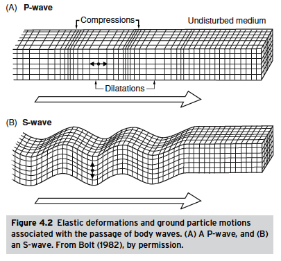
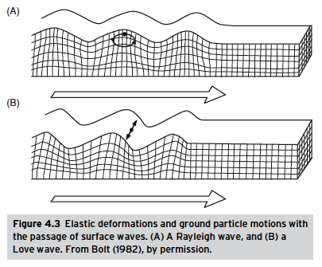
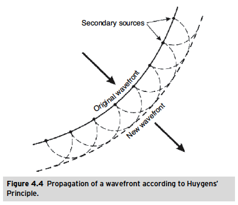
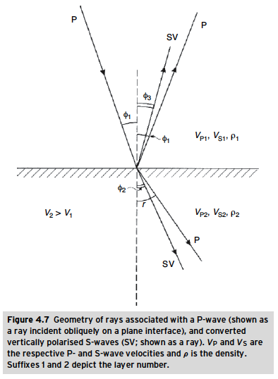
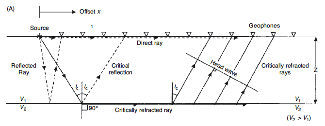
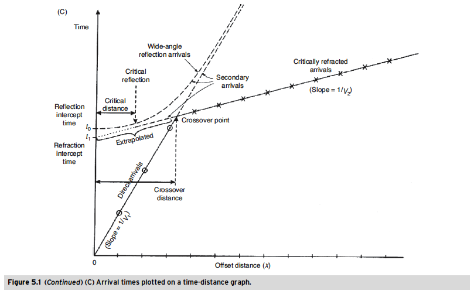
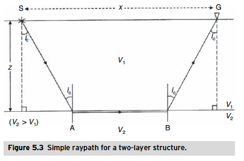
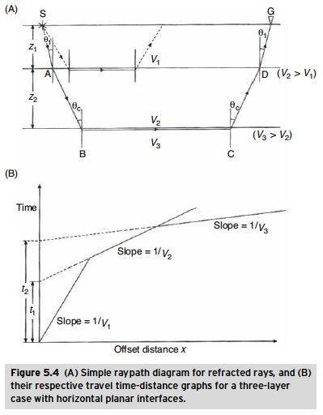
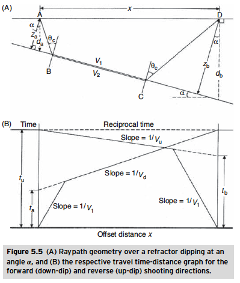

List of Figures
===============

Elastic moduli
----------------
((A) Young’s modulus; (B) bulk (rigidity) modulus; (C) shear modulus; (D) axial modulus.)

=================================================================

Body Waves
----------------

Surface Waves
----------------

=================================================================

Huygens' Principal
----------------

=================================================================

Reflection and Refraction Laws (Snel's Law)
----------------

=================================================================

Raypath diagram
----------------

=================================================================

Travel time curves
----------------

=================================================================

Simple Raypath for a horizontal two layer structure 
----------------

=================================================================

Multilayer case
----------------

=================================================================

Dipping layers
----------------

=================================================================