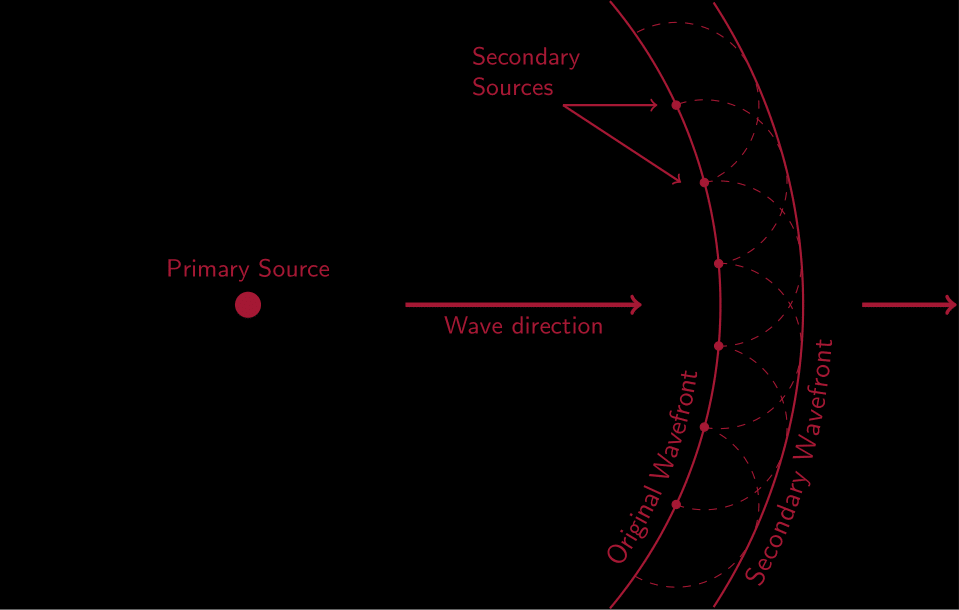

New Materials
===============
Literature review
-----------------
- Illegal cross‐border tunnels (active)

https://doi.org/10.1190/1.3627464 Subsurface voids may manifest themselves as
natural or anthropogenic dissolution features, illegal cross‐border tunnels, or
abandoned mines. Detection of these voids using geophysical methods has often
proven difficult due to multiple factors including depth‐to‐diameter ratio, lack
of resolution, non‐uniqueness, etc. Experiments were conducted at a test site
with a known subsurface void to determine the capability of multiple
near‐surface seismic methods as applied to void detection. In this study,
refraction tomography and multichannel analysis of surface wave methods
successfully identified a man‐made void approximately three meters deep. 

- Seismology on Mars (SEIS) (passive)

SEIS News - SEIS / Mars InSight (seis-insight.eu) SEIS | Max Planck Institute
for Solar System Research (mpg.de) The Seismic Experiment for Interior Structure
(SEIS) is part of the scientific payload of NASA’s InSight mission. Landing on
Mars in 2018, SEIS will be the first European seismometer on another planet. The
instrument is capable of recording ground motions of a fraction of 0.001 mm over
a broad frequency range between 0.001 Hz and 50 Hz. In this way, it can capture
signals from marsquakes, meteorite impacts, local events like dustdevils or
landslides, and even the tiny tidal deformation of Mars induced by its moon
Phobos. Recording and analyses of seismic waves that have been transmitted
through the interior of Mars will provide important insights into the planet’s
interior structure. SEIS is expected to run continuously for at least one
Martian year (687 days) and collect sufficient data to address a number of
scientific questions. 

- Detection of underground nuclear testing (passive? Bomb is a type of trigger I
  guess)

Monitoring of Underground Nuclear Tests by Seismic Stations in the Former Soviet
Union (FSU) | SpringerLink This paper gives the total numbers of underground
nuclear explosions detected and identified for each nuclear weapon state, and
shows how the detection capability improved with time. The monitoring capability
of the network of the Former Soviet Union (FSU) is compared with that of the
International Seismological Center (ISC). Relationships between body wave
magnitude and explosion yield are determined for all nuclear test sites. A
discussion is given of seismic monitoring capabilities for the following
International treaties, actual and proposed: Threshold Test Ban Treaty (TTBT),
Peaceful Nuclear Explosion Treaty (PNET), Comprehensive Test Ban Treaty (CTBT),
Non Proliferation Treaty (NPT). Analysis of 204 early unannounced underground
nuclear explosions (UNE) conducted by the U.S. at the Nevada Test Site (NTS)
shows that 61 of them were detected by the seismic network of the FSU. As a
result of this analysis, the sensitivity threshold of seismic monitoring of UNE
at teleseismic distances by seismic network stations in the FSU has been
estimated more accurately.

- Designing Windparks (passive and active)

Seismic considerations in design of offshore wind turbines - ScienceDirect
Interest in renewable and clean energy over the past decade has motivated
immense research on wind energy. The main issues in design of offshore wind
turbines in regions of recent development have been aero- and hydro-dynamic
loads; however, earthquake is a design concern in seismic areas such as East
Asia and Western United states. This paper reviews the state of practice in
seismic design of offshore wind turbines. It is demonstrated that wind turbines
are in particular vulnerable to vertical earthquake excitation due to their
rather high natural frequencies in vertical direction; however, inclusion of the
radiation damping could contribute considerably reduce the earthquake loads.
Moreover, it is demonstrated how soil nonlinearity could lead to settlement and
permanent tilting of offshore wind turbines on caisson foundations or tripods.
Using these cases, the paper demonstrates that the design of offshore wind
turbines for earthquake loading is driven by performance-based considerations.

- Geological, Geotechnical and Geophysical Aspects of Zafarana Wind Farms Sites
  and Their Expansion at Gabel El Zeit Sites Egypt - IOPscience
The growing need for sustainable power generation has led to increasing number
of power plants, of fossil-fuel type and of non-conventional type. The
foundation types of wind turbine towers in power plant structures are mainly
depend on the geotechnical and structural considerations and other geological
and geophysical considerations. The safety and economic conditions also play a
vital role in the design of foundations. Such foundations must effectively be
designed taken into consideration large overturning moments and dynamic loading
due to extreme wind and earthquakes. The present research is focused on studying
the geotechnical, geological and geophysical aspects and characterizes of soils
in Zafarana Wind Farms sites and their expansion at Gabel El Zeit sites on the
Suez Gulf of Egypt. The study first address and study the geological aspects of
both sites Zafarana Wind Farms sites and Gabel El Zeit sites. Secondly, the
geotechnical and geophysical characteristics are studied based on establishing
data base from 698 borings and 8 seismic refraction profiles across Zafarana
wind Farm sites and 10 borings and 2 seismic refraction profiles at Gabel El
Zeit site. The geotechnical testing and geophysical profiles were compiled to
determine the variation of the soil profile as well as the characteristics of
the soil layers within the study sites. The results showed construction of 8
representative boring logs at Zafarana Wind Farm sites and 2 representative
boring logs Gabel El Zeit sites to represent the characteristics of the soil
layers and site statgerphy. Also, the study shows the result of compression wave
velocity and shear wave velocity across both sites and within the studied soil
layers up to 30 m. All these results from this research will help to study the
foundation and the structure of wind turbine tower, where these types of tall
structures are similar to chimney structures in design and other engineering
considerations.

- Also very interesting: Wind farms generate seismic noise 

WES - Reduction of wind-turbine-generated seismic noise with structural measures
(copernicus.org) Reducing wind turbine noise recorded at seismological stations
promises to lower the conflict between renewable energy producers and
seismologists. Seismic noise generated by the movement of wind turbines has been
shown to travel large distances, affecting seismological stations used for
seismic monitoring and/or the detection of seismic events. In this study, we use
advanced 3D numerical techniques to study the possibility of using structural
changes in the ground on the wave path between the wind turbine and the seismic
station in order to reduce or mitigate the noise generated by the wind turbine.
Testing a range of structural changes around the foundation of the wind turbine,
such as open and filled cavities, we show that we are able to considerably
reduce the seismic noise recorded by placing empty circular trenches approx.
10 m away from the wind turbines. We show the expected effects of filling the
trenches with water. In addition, we study how relatively simple topographic
elevations influence the propagation of the seismic energy generated by wind
turbines and find that topography does help to reduce wind-turbine-induced
seismic noise.

=================================================================
Huygens' Principal
-------------------

=================================================================
Snel's Law
-----------
.. image:: ../_gfx/Paula_SnellsLaw.png
    :width: 400