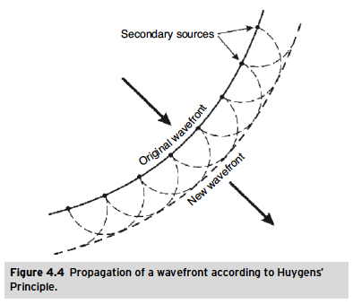
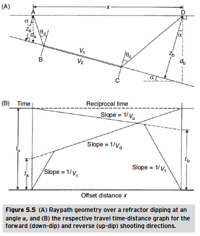

.. CIVIS documentation master file, created by
   sphinx-quickstart on Wed Dec 13 17:08:58 2023.
   You can adapt this file completely to your liking, but it should at least
   contain the root `toctree` directive.
CIVIS - Tübingen Geophysics 
========================

.. toctree::
   :maxdepth: 2

Some Basic Information
-----------------------
- Let's aim to make most of the figures like animation (at least those that make sense).
- Here are some useful website that might help you:
   - https://typeset.io (AI to look for papers)
   - https://www.perplexity.ai (AI for science questions based on GPT 4)
   - https://www.manim.community (Python library for creating mathematical animations)

- Uni Tübingen in Adobe RGB color
   - Red: 138, 36, 59
   - Gold: 141, 111, 34

List of Figures We Need
-----------------------
- Elastic moduli ((A) Young’s modulus; (B) bulk (rigidity) modulus; (C) shear modulus; (D) axial modulus.)
  
=================================================================
  
- Seismic wave types (Surface & Body waves)
.. image:: _gfx/BodyWaves.png
   :width: 400

.. image:: _gfx/SurfaceWaves.png
   :width: 400
=================================================================

- Huygens' Principal

=================================================================

- Reflection and Refraction Laws (Snel's Law)
.. image:: _gfx/SnellsLaw2.png
   :width: 400
=================================================================

- Raypath diagram
.. image:: _gfx/RaypathGeometry.png
   :width: 400
=================================================================

- Travel time curves
.. image:: _gfx/TravelTimesCurve.png
   :width: 400
=================================================================

- Simple Raypath for a horizontal two layer structure 
.. image:: _gfx/SimpleTwoLayersRaypath.png
   :width: 400
=================================================================

- Multilayer case
.. image:: _gfx/SimpleThreeLayersRaypath.png
   :width: 400
=================================================================

- Dipping layers

=================================================================

Introduction
-----------------------
- Seismology (causes and effects of earthquakes)
- Passive Seismic (Interior structure of the Earth, Oil and Gas Reservoirs)
- Active Seismic (...)

Fundamental Concepts of Seismic Waves
-------------------------------------

- Types of Seismic waves (body waves & surface waves)

   Two types of body waves can travel through elastic medium (P and S).
      - P waves (primary or compressional waves) are longitudinal waves that travel with a speed of about 6 km/s in the Earth’s crust. P waves are the fastest seismic waves and are the first to arrive at a seismometer after an earthquake. P waves can travel through solids, liquids, and gases.
      - S waves (secondary or shear waves) are transverse waves that travel with a speed of about 3.5 km/s in the Earth’s crust. S waves are the second fastest seismic waves and are the second to arrive at a seismometer after an earthquake. S waves can travel only through solids.

   Surface waves are confined to the surface of the Earth and do not penetrate deep into the subsurface (Rayleigh and Love waves).
      - Rayleigh waves are the slowest seismic waves and are the last to arrive at a seismometer after an earthquake. Rayleigh waves are similar to water waves and cause the ground to move up and down and side to side in a rolling motion.
      - Love waves are the second slowest seismic waves and are the second to last to arrive at a seismometer after an earthquake. Love waves are similar to water waves and cause the ground to move side to side in a horizontal motion.

- One Dimensional Seismic Wave Equation
.. math::
   u(x, t) = A * sin(kx - ωt + θ)

- Seismic Wave Propagation Velocity
- Stress and Strain (introducing elastic moduli e.g., Young, Bulk, density paradox)

Principles of Seismic Field Measurements
----------------------------------------

- Seismic energy sources
- Detection and recording of seismic waves
- Source and Receiver Setup
- Data example of a single trace and a shot gather 
- Raypath geometry
   - Huygen’s Principle
   - Reflection and Refraction Laws (Snel’s Law)
   - Critical refraction
   - Headwave (Refracted Waves)
   - Raypath and Travel Times for Direct, Reflected, and Refracted Waves

Application in Mapping
----------------------
   - Techniques for Mapping Layers with Refraction Seismic
   